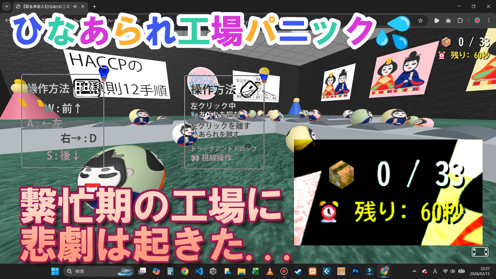

# vr-hinamatsuri-2026
【緊急事態⚠】ひなあられ工場パニック💦33個回収せよ📣

（A-Frameで作成）

# 🎎 ストーリー (Story)
* ひなまつり直前
* 繁忙期のひなあられ工場に
* 突如悲劇が ... 。
* 出荷直前、ひなあられの袋が破裂💦
* 工場内に33個飛び散ってしまった。
* 出荷に間に合うか？急いで回収せよ！

## 🎮 遊んでみる・見てみる (Play & Watch)
👉 **[🎮 今すぐブラウザで遊ぶ (Play Demo)](https://gyosei-yuki.github.io/vr-hinamatsuri-2026/)**

※ スマホでもPCでも遊べます！

👉 **[🎥 デモプレイ動画を見る (ニコニコ動画)](https://www.nicovideo.jp/watch/sm45953806)**

## 概要 (Overview)
* 制限時間は60秒🕐
* 工場内に飛び散ったひなあられをクリック🥎
* ベルトコンベアに載せて中央へ集荷🧳
* オーソドックスなWASDコントローラー🎮

## 使用技術 (Tech Stack)
* HTML / JavaScript
* A-Frame (WebVRフレームワーク)
* Gemini（ゲーム部分は、ほぼGemini）

## 制作者 (Author)
**渋谷佑生 (Yuki Shibuya)**
* 岩手県で活動する「表現する実務家（行政書士）」
* 音楽配信したり
* 算命学のアプリを配信したり

あまり、行政書士っぽくない活動をしています。
